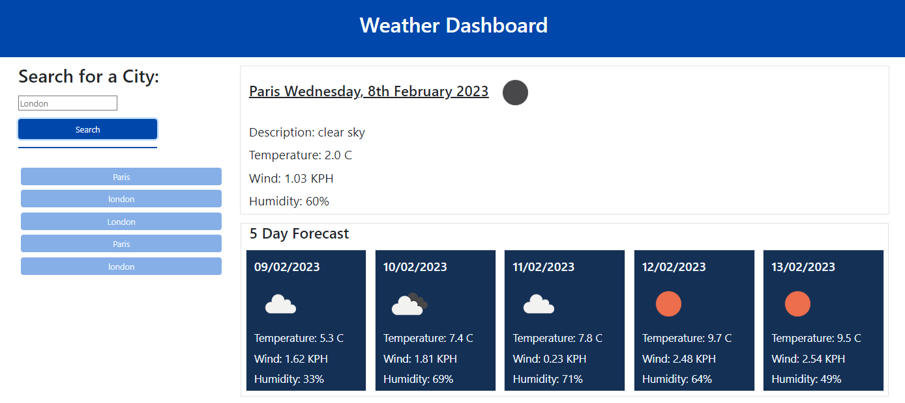

# Weather-App-WC8
Repo to hold the code for the Trilogy Bootcamp weekly challenge 8 - Weather app

## Description

This project was made in response to the Trilogy Front End Bootcamp Weekly Challenge 8 - weather application.

We were tasked with this user story

AS A traveler
I WANT to see the weather outlook for multiple cities
SO THAT I can plan a trip accordingly

The requirements were as follows:

- Create a weather dashboard with form inputs.
- When a user searches for a city they are presented with current and future conditions for that city and that city is added to the search history
- When a user views the current weather conditions for that city they are presented with:
    - The city name
    - The date
    - An icon representation of weather conditions
    - The temperature
    - The humidity
    - The wind speed
- When a user view future weather conditions for that city they are presented with a 5-day forecast that displays:
    - The date
    - An icon representation of weather conditions
    - The temperature
    - The humidity
- When a user click on a city in the search history they are again presented with current and future conditions for that city
## Installation

No additional installation should be needed. The files were created in Visual Studio Code and consist of the basic website format - html, css, javascript, png.
API's used:
-   Moment - for the time and date calculations - https://momentjs.com/
-   Open Weather API - for the weather information - https://openweathermap.org/api

## Usage

To be used by anyone who wants to check the weather.

To be used by Trilogy Education to asses how will I met the acceptance criteria.

To be used by anyone as a study guide - I tried to make copius notes to show my logic throught the creation of the script

Finally it was used by me as a great way to practice coding!

*picture showing an example search and the information that the app will display*

## Credits

-   Starter code provided by Trilogy education 
-   Bootstrap was used to assist with the layouts 
-   JQuery was used in the creation of script elements 

## License

Please refer to the repo for the license information.

## Link to live site

https://ncstorey.github.io/Weather-App-WC8/ 